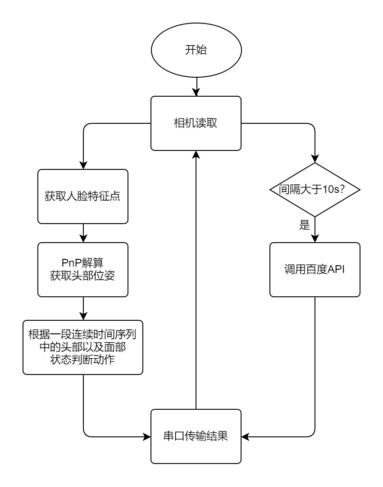
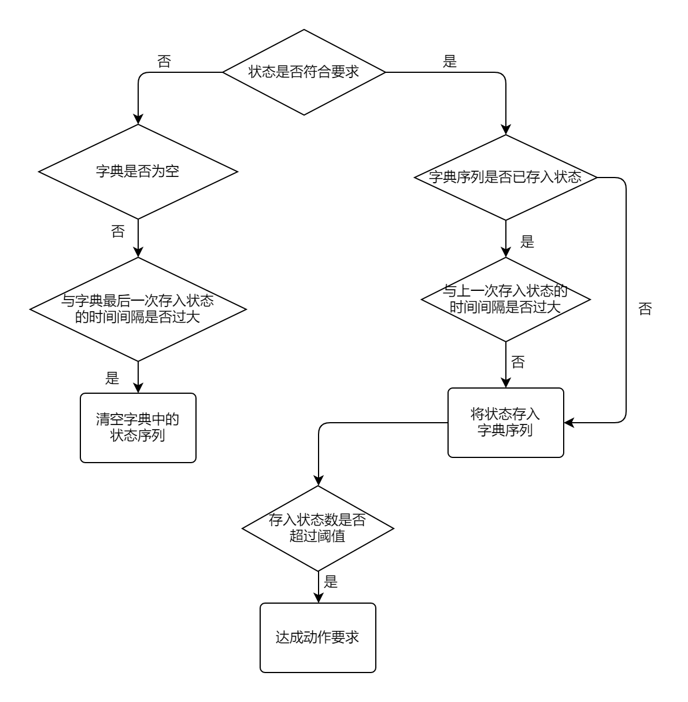

# DriveModuleDetect
## 1. 介绍
  使用Mediapipe以及百度API进行驾驶行为分析，主要检测的状态如下  
|  状态   | 是否使用百度API  |
|  ----  | ---- |
| 打哈欠  | 否 |
| 闭眼 | 否 |
| 打瞌睡  | 否 |
| 未目视前方| 否 |
| 使用手机 | 是 |
| 抽烟 | 是 |
| 未佩戴口罩 | 是 |
| 是否系安全带 | 是 |

  Mediapipe是有Google开发并开源的一个机器学习模型应用框架。通过调用其API完成人脸关键点检测。  
  通过调用百度AI的驾驶行为分析API完成抽烟以及使用手机等检测。

## 2.环境配置
  计算平台：树莓派4B 4g  
  系统：Raspbian OS 64bits  
  
## 3. 流程图

## 4. 算法思路
### 4.1 动作判断算法
由于人体的动作是一个在时间上连续的过程，仅仅凭一帧图片里的状态是不足以判定动作的，例如需要判断打瞌睡闭眼时，如果我们仅凭当前帧中人物闭眼来判断其是否打瞌睡，显然是会出现问题的，因为人在正常状态下是会眨眼的，所以很容易误判。所以我设计了一个小算法，用于根据连续时间序列的图片来判断相应动作。具体流程如下。  

  
在字典序列中，count(已存入状态数)为key，timestamp(当前帧时间点)为value。其中状态数阈值的设定应当根据具体图片处理速度进行调整。  

### 4.2 各类头部状态的判定（一帧图片中）
  首先通过mediapipe中的模型获取脸部特征点，并筛选出需要的23点。

  通过PnP迭代法解算出头部位姿的**欧拉角EularAngle**，判断当前帧驾驶员头偏移的角度是否过大。[PnP所需3D点参考链接](https://github.com/lincolnhard/head-pose-estimation.git)  

  根据**眼皮间距离**与**眼角间距离**的比值判定是否闭眼。  

  根据**上下嘴唇距离**与**嘴角距离**的比值判定是否张嘴（用于判断打哈欠）。

### 4.3 百度API
  由于缺少驾驶环境下的抽烟以及使用手机的数据集，我选取通过调用百度AI的**驾驶行为分析API**完成相应的检测，同时也可顺便获取诸如是否戴好口罩的一些状态。又由于百度API是根据调用次数计费，所以设定了调用时间间隔。
